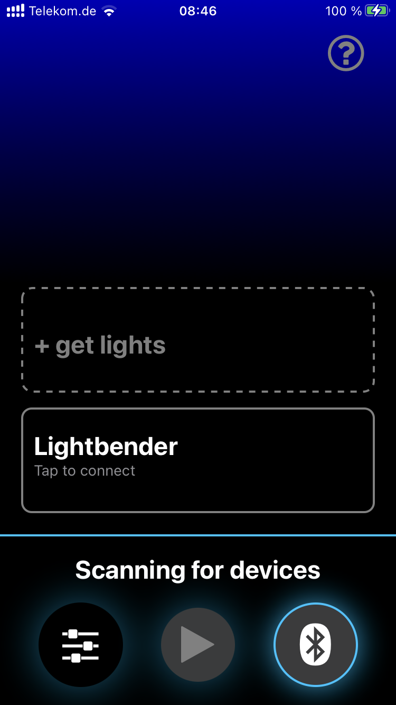
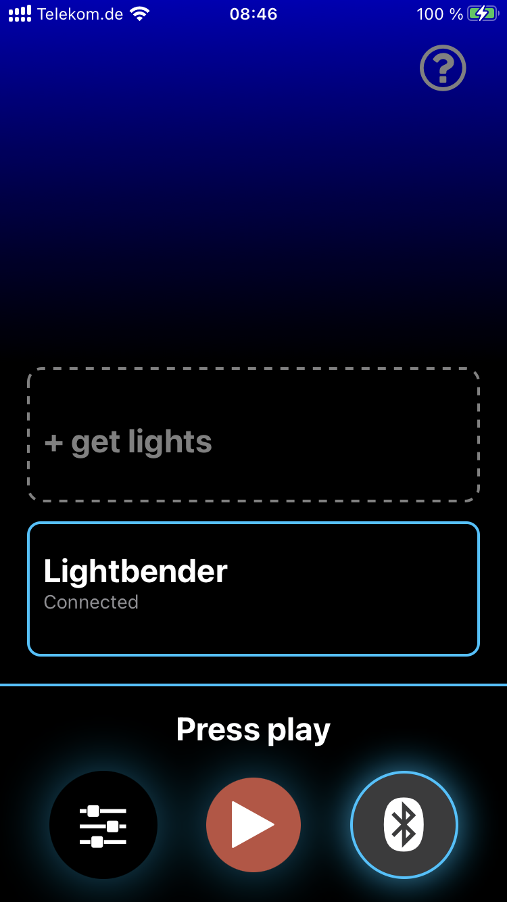

Biking is fun, good for your health, and good for the environment. However, there is a real danger of being hit by a car because of low visibility when biking in the city. Putting lights can make biking in the city safe again, and I wanted to see if I could build an application that encouraged more people to put lights on their bike.

**Bike Light** is a mobile application that makes biking safer by making it more fun. It uses the speed, acceleration, and direction measured by your phone to control an interactive light show displayed on LEDs. Users who install the lights onto their bike have an enhanced sense of joy while riding, because they can create a lightshow through their own biking style—while also increasing their visibility to cars.

<iframe width="560" height="315" src="https://www.youtube.com/embed/lT3SwKlmAvs?si=ymLLxO1nV6FxacOj" title="Bike Light Demo" frameborder="0" allow="accelerometer; autoplay; clipboard-write; encrypted-media; gyroscope; picture-in-picture; web-share" allowfullscreen></iframe>

I designed Bike Light's user interface to be easy to use on a bike. All of the key controls are on the bottom of the screen, so you can pair your lights or change settings with one hand. The app and lights give users clear feedback when the lights have paired, disconnected, or are still loading, so they never feel lost.

Later in development, I ran into the problem that iOS does not allow the required Bluetooth to run in the background. This meant the user could not turn off their phone screen while using the app. I adapted by making the color of the screen responsive to movement as well, and built a curtain that would lock the screen to prevent accidental touches.

<iframe width="560" height="315" src="https://www.youtube.com/embed/jX39QiVEQ6s?si=O9eBbEQIX8TFMghY" title="Bike Light Lock Screen Demo" frameborder="0" allow="accelerometer; autoplay; clipboard-write; encrypted-media; gyroscope; picture-in-picture; web-share" allowfullscreen></iframe>

The Bike Light App is developed using **React Native**, allowing a single JavaScript codebase to be used for both Android and iOS. The microcontrollers for the LEDs were programmed with **Arduino C++**.

As of now, I have left the project on hold. To distribute the app fully, I would need to manufacture the light kits, which is a major additional step. Nevertheless, I loved building this app and it taught me a lot about mobile and embedded development, as well as the importance of focusing on software products that don't require additional hardware for easier scalability.
