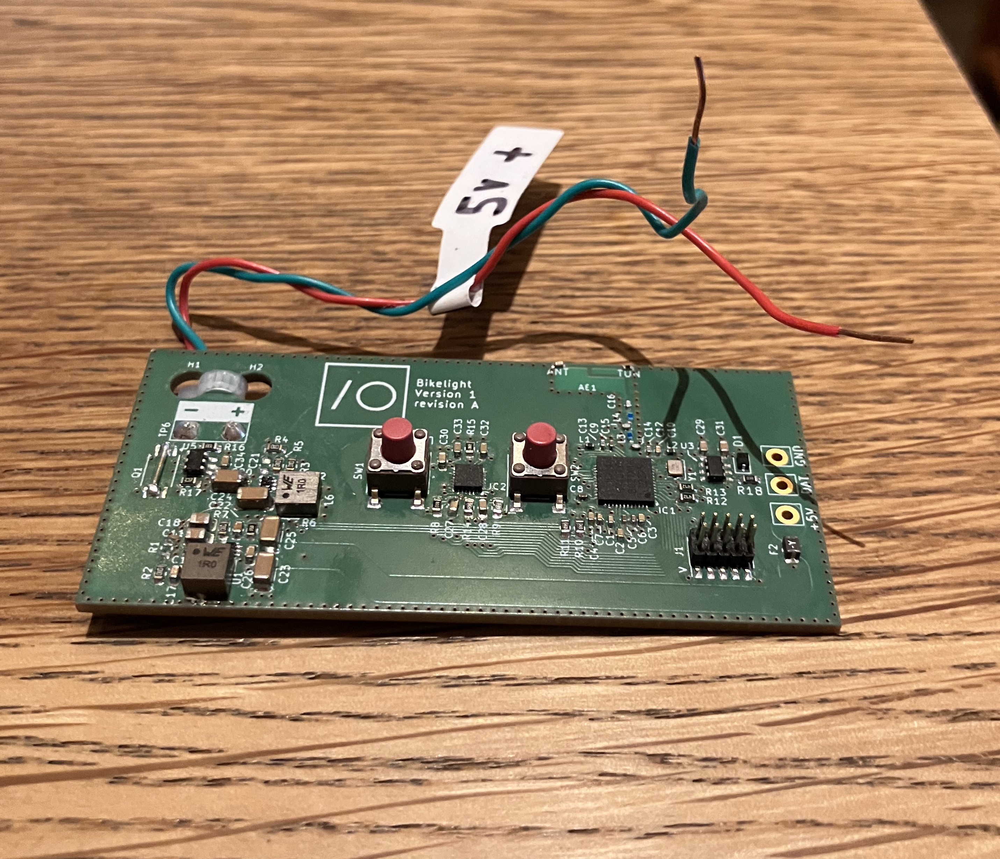

For my internship I was given the opportunity to design and build a project from scratch, learning the basics of C, C++, and embedded programming along the way.

I had been interested in building unconventional controllers for LEDs, and I designed a small embedded application that translated motion data from an ICM20649 IMU into customizable LED patterns.

I wrote an SPI driver from scratch for WS2812b LEDs, configured the IMU (ICM20649) via register programming, and implemented the motion-to-light translation logic in C++ using an object-oriented approach.

The project served as both a demonstration and a feedback tool for our in-house operating system, helping promote its usability within the company. The work I did on this project contributed directly to securing my position at ImagineOn.

<video controls src="lightbender_emb_drv_2.MOV" title="Lightbender embedded driver debugging"></video>

<video controls src="lightbender.MOV" title="Title"></video>
