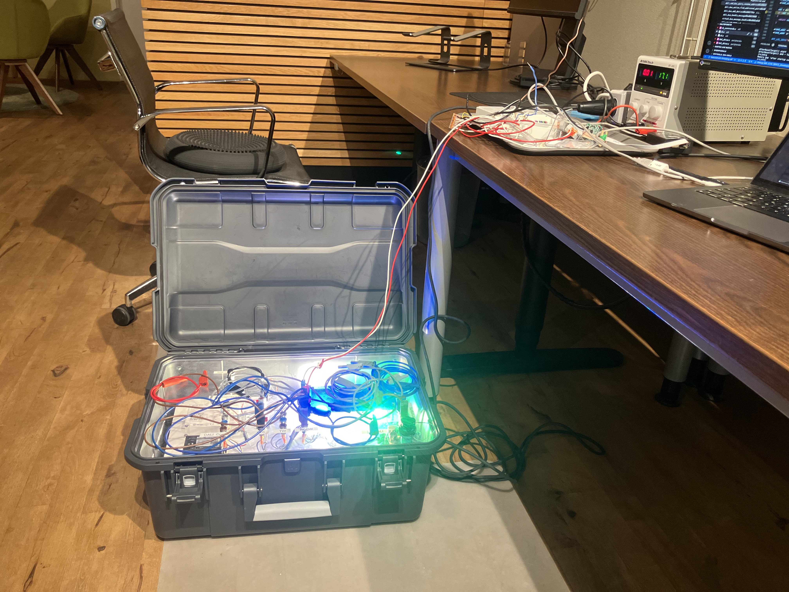

I was tasked with refactoring the DALI (Digital Addressable Lighting Interface) driver for a major lighting supplier who was building a gateway device to operate over both Zigbee and DALI.

I reconfigured the clocking configuration, optimized interrupt handling, and implemented previously unused DALI features including multi-reply handling, bus short detection, and multi-master message processing.

These enhancements resulted in a more efficient and complete driver, which was released to the client and is now part of a product in preparation for large-scale deployment.

