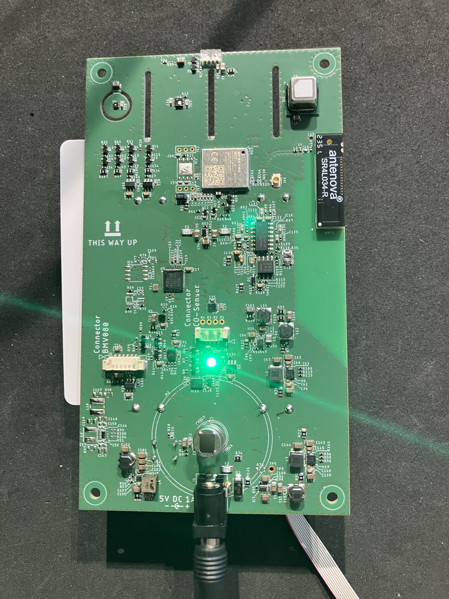

I joined the second revision of a prototype for a major car manufacturer that collected data from 11 sensors and transmitted it to AWS for analysis. This version required LTE instead of Wi-Fi, and I was responsible for integrating the BG77 modem.

I developed a driver for its coprocessor, implemented AT command parsing, HTTPS communication, MQTT messaging, OTA updates, and low-power optimization like limiting the bandwidths we were scanning when registering with our network.

I also helped design and support our testing strategy and integrated a hardware watchdog for reliability and integrated a new BME080 sensor.

The LTE-enabled prototype was completed successfully and is undergoing internal evaluation for potential mass production.

