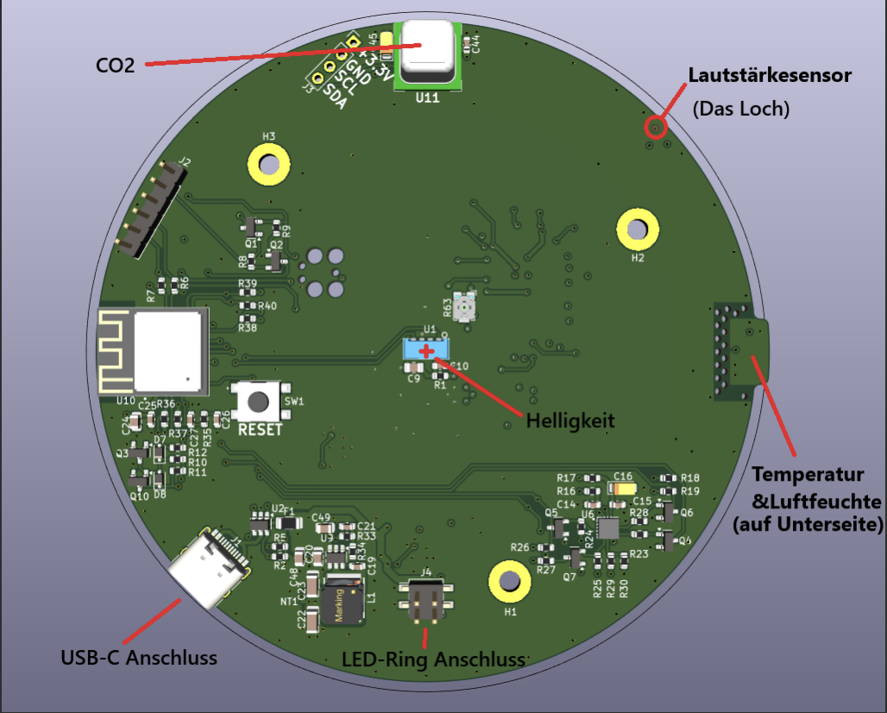
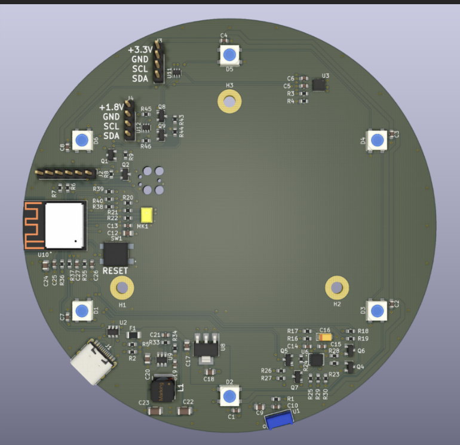

I worked on the second revision of an office environment sensor prototype. The updated board layout required changes to the firmware's pin routing, so I examined the revised schematics, verified wiring, and updated the firmware accordingly. I then tested the new configuration and  to ensure the firmware was ready for the updated hardware.

