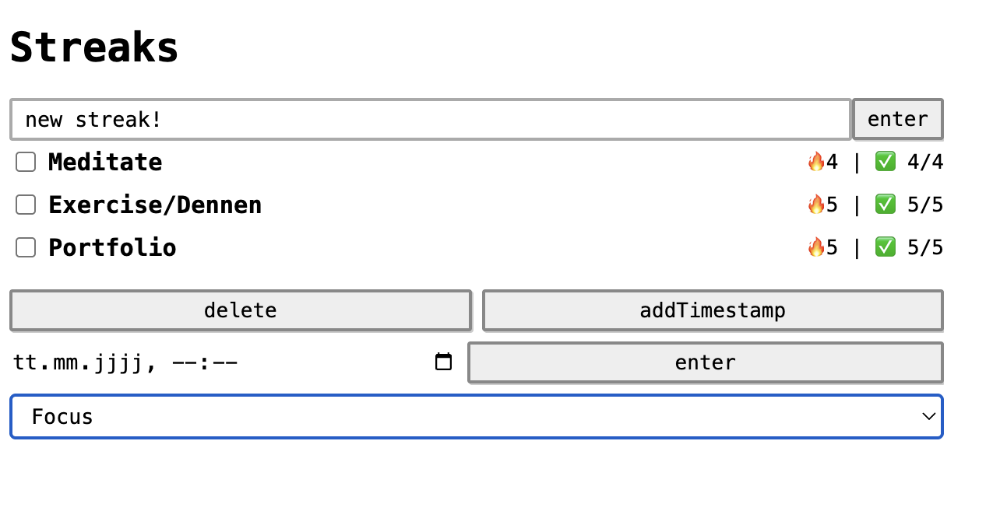

I created a minimalist habit tracker inspired by "streak" tracker like snapchat or other behavior apps, but stripped of the cluttered UI and extra features. I built it in raw JavaScript with an Model-View-Controller architecture and connected it to Firebase.

I initially prototyped in React Native but switched to a lightweight web build for simplicity and portability. I also created a data access layer for future flexibility and testing, which sets a single API for connecting to multiple data sources.

The resulting app is something I use daily to help me build good habits, and it now serves as a reusable, extensible codebase for future projects.

